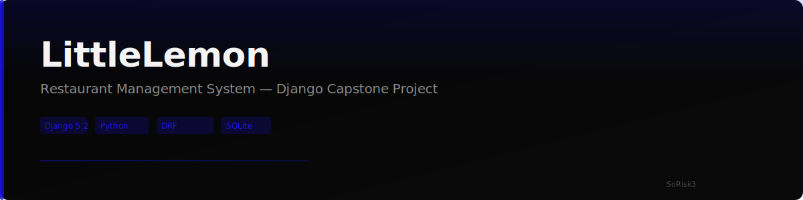

<p align="center">
  
</p>

<p align="center">
  <a href="https://www.djangoproject.com/">
    
  </a>
  <a href="https://www.python.org/">
    
  </a>
  <a href="https://www.django-rest-framework.org/">
    
  </a>
  <a href="https://www.sqlite.org/">
    
  </a>
  
</p>

---

## 📋 Overview

**LittleLemon** is a full-stack restaurant management system built as a Coursera capstone project. It provides a web interface for restaurant operations including menu management, table booking, and user authentication — powered by Django and the Django REST Framework.

---

## ✨ Features

| Feature | Description |
|---------|-------------|
| 🍽️ **Menu Management** | Full CRUD for restaurant menu items with pricing and inventory tracking |
| 📅 **Table Booking** | Customer booking system with guest count and date/time management |
| 🔐 **User Authentication** | Token-based auth with user registration and permissions |
| 📊 **RESTful API** | Expose menu, bookings, and users via DRF endpoints |
| 🖥️ **Admin Dashboard** | Django admin interface for staff management |

---

## 🛠️ Tech Stack

```
Backend          Django 5.2 · Django REST Framework · Python 3.x
Database         SQLite (dev) · Django ORM
Authentication   Django Auth · Token-based API auth
Serialization    ModelSerializers for Booking, Menu, User
Testing          Django TestCase · DRF API TestCase
```

---

## 🏗️ Architecture

```
┌─────────────────────────────────────────────────────────┐
│                     Client (Browser)                      │
└─────────────────────┬───────────────────────────────────┘
                      │ HTTP / AJAX
                      ▼
┌─────────────────────────────────────────────────────────┐
│               Django Application (LittleLemon)            │
│  ┌────────────┐  ┌────────────┐  ┌──────────────────┐   │
│  │  Templates  │  │    URLs    │  │  DRF Serializers │   │
│  │  (HTML/CSS) │  │  /menu/   │  │  MenuSerializer  │   │
│  │             │  │  /booking │  │  BookingSerializer│   │
│  │             │  │  /api/    │  │  UserSerializer   │   │
│  └────────────┘  └─────┬──────┘  └────────┬─────────┘   │
│                        │                   │              │
│                        ▼                   ▼              │
│              ┌──────────────────────────────────┐         │
│              │       Django ORM / Models         │         │
│              │  Booking · Menu · MenuItem · User │         │
│              └──────────────┬───────────────────┘         │
└─────────────────────────────┼───────────────────────────┘
                              │
                              ▼
                    ┌──────────────────┐
                    │     SQLite DB     │
                    │  (db.sqlite3)     │
                    └──────────────────┘
```

---

## 🚀 Getting Started

### Prerequisites
- Python 3.x
- pip (Python package manager)
- Virtual environment (recommended)

### Setup

```bash
# 1. Clone the repository
git clone https://github.com/sorisk3-git/Capstone-project.git
cd Capstone-project/LittleLemon

# 2. Create and activate a virtual environment
python -m venv venv
source venv/bin/activate  # On Windows: venv\Scripts\activate

# 3. Install dependencies
pip install -r requirements.txt

# 4. Run database migrations
python manage.py migrate

# 5. Create a superuser (admin)
python manage.py createsuperuser

# 6. Start the development server
python manage.py runserver
```

Visit **http://localhost:8000** in your browser.

---

## 🔌 API Endpoints

| Method | Endpoint | Description | Auth Required |
|--------|----------|-------------|:---:|
| GET/POST | `/menu-items/` | List / create menu items | ✅ |
| GET/PUT/DELETE | `/menu-item/<id>` | Retrieve / update / delete menu item | ✅ |
| GET/POST | `/booking/tables/` | List / create bookings | ✅ |
| GET/PUT/DELETE | `/booking/tables/<id>` | Retrieve / update / delete booking | ✅ |
| POST | `/api-token-auth` | Obtain authentication token | ❌ |
| GET | `/message/` | Protected test endpoint | ✅ |

---

## 🔐 Development Credentials

> ⚠️ **For local development only** — change before deploying to production.

| Role | Username | Email | Password |
|------|----------|-------|----------|
| Superadmin | `capstone` | `capstone@littlelemon.com` | `@project123!` |

**API Token (pre-generated):** `64c325e7a2678b995780e75e598d0269be621704`

---

## 📚 What I Learned

- Building RESTful APIs with Django REST Framework
- Model serialization and validation patterns
- Token-based authentication workflows
- Django ORM query optimization
- Test-driven development with Django's test suite
- Handling merge conflicts in collaborative workflows

---

## 📄 License

This project is licensed under the MIT License — see the [LICENSE](LICENSE) file for details.

---

<p align="center">
  <sub>Built as part of the <a href="https://www.coursera.org/">Coursera</a> Django Backend Specialization</sub>
  <br>
  <sub>© 2025 · SoRisk3</sub>
</p>
